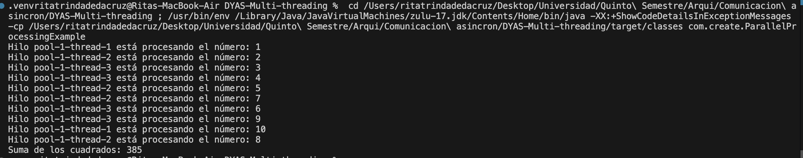

# Proyecto de Procesamiento Paralelo en Java

Este proyecto implementa un ejemplo de procesamiento paralelo en Java usando hilos, donde se calculan los cuadrados de una lista de números del 1 al 10 utilizando múltiples hilos. El código hace uso de la interfaz `Callable` y el servicio `ExecutorService` para ejecutar tareas de manera concurrente y obtener los resultados.

## Tecnologías

- **Java 17**
- **ExecutorService**
- **Callable**
- **Future**

## Estructura del Proyecto

El proyecto está compuesto por dos clases principales:

1. **`SquareTask.java`**: Una clase que implementa la interfaz `Callable` para calcular el cuadrado de un número.
2. **`ParallelProcessingExample.java`**: La clase principal que gestiona la creación y ejecución de los hilos en paralelo utilizando un `ExecutorService`.

### 1. **`SquareTask.java`**

Esta clase implementa la interfaz `Callable<Integer>`, lo que permite ejecutar el cálculo del cuadrado de un número en un hilo separado. El método `call()` es el encargado de calcular el cuadrado de un número.

```java
package com.create;

import java.util.concurrent.Callable;

public class SquareTask implements Callable<Integer> {
    private int num;

    public SquareTask(int num) {
        this.num = num;
    }

    @Override
    public Integer call() throws Exception {
        // Imprime el nombre del hilo que está ejecutando la tarea
        System.out.println("Hilo " + Thread.currentThread().getName() + " está procesando el número: " + num);
        
        // Calcula el cuadrado del número
        return num * num;
    }
}
```

### 2. **`ParallelProcessingExample.java`**

La clase principal crea un conjunto de tareas (`SquareTask`), las envía al `ExecutorService` para ser ejecutadas en paralelo y luego recoge los resultados. El `ExecutorService` gestiona el pool de hilos, distribuyendo las tareas entre ellos. Al final, se calcula la suma de los cuadrados de todos los números procesados.

```java
package com.create;

import java.util.ArrayList;
import java.util.List;
import java.util.concurrent.Callable;
import java.util.concurrent.ExecutionException;
import java.util.concurrent.ExecutorService;
import java.util.concurrent.Executors;
import java.util.concurrent.Future;

public class ParallelProcessingExample {

    public static void main(String[] args) {
        // Lista de números a procesar
        List<Integer> numbers = new ArrayList<>();
        for (int i = 1; i <= 10; i++) {
            numbers.add(i);
        }

        // Creamos un pool de hilos con 3 hilos
        ExecutorService executor = Executors.newFixedThreadPool(3);

        // Lista para almacenar las tareas (Callable)
        List<Callable<Integer>> tasks = new ArrayList<>();

        // Definimos las tareas: calcular el cuadrado de cada número
        for (int num : numbers) {
            // Crear una tarea SquareTask para cada número
            tasks.add(new SquareTask(num));
        }

        try {
            // Enviamos las tareas al pool y obtenemos los resultados
            List<Future<Integer>> results = executor.invokeAll(tasks);

            // Sumamos los resultados de las tareas
            int totalSum = 0;
            for (Future<Integer> result : results) {
                totalSum += result.get(); // Esperamos a que cada tarea termine y obtenemos el resultado
            }

            // Imprimimos el resultado final
            System.out.println("Suma de los cuadrados: " + totalSum);
        } catch (InterruptedException | ExecutionException e) {
            e.printStackTrace();
        } finally {
            // Cerramos el pool de hilos
            executor.shutdown();
        }
    }
}
```

## ¿Cómo funciona el código?

### Generación de Números
El código genera una lista de números del 1 al 10 que se procesarán para calcular sus cuadrados.

### Creación del ExecutorService
Se crea un pool de hilos utilizando `ExecutorService`, con un máximo de 3 hilos. Este pool es responsable de ejecutar las tareas en paralelo.

### Definición de Tareas
Se crean instancias de `SquareTask` para cada número de la lista. Cada tarea se encarga de calcular el cuadrado de un número y devolver el resultado.

### Ejecución de Tareas
Las tareas se envían al `ExecutorService` para ser ejecutadas en paralelo. El método `invokeAll` se utiliza para ejecutar todas las tareas de manera concurrente y recoger los resultados.

### Obtención de Resultados
Se espera que todas las tareas terminen utilizando `result.get()`. Luego, se suman todos los resultados de los cuadrados.

### Impresión del Resultado Final
Finalmente, se imprime la suma de los cuadrados de los números.

### Cierre del ExecutorService
Después de que todas las tareas se han completado, se cierra el pool de hilos utilizando `executor.shutdown()`.

## Salida Esperada

Cuando se ejecuta el programa, deberías ver una salida similar a esta en la consola:

```
Hilo pool-1-thread-1 está procesando el número: 1
Hilo pool-1-thread-2 está procesando el número: 2
Hilo pool-1-thread-3 está procesando el número: 3
Hilo pool-1-thread-1 está procesando el número: 4
Hilo pool-1-thread-2 está procesando el número: 5
Hilo pool-1-thread-3 está procesando el número: 6
Hilo pool-1-thread-1 está procesando el número: 7
Hilo pool-1-thread-2 está procesando el número: 8
Hilo pool-1-thread-3 está procesando el número: 9
Hilo pool-1-thread-1 está procesando el número: 10
Suma de los cuadrados: 385
```




## ¿Por qué usar procesamiento paralelo?

El procesamiento paralelo es útil para realizar tareas independientes al mismo tiempo, lo que mejora el rendimiento en aplicaciones que necesitan manejar múltiples tareas simultáneamente. En este caso, calculamos el cuadrado de varios números de manera paralela, lo que permite que cada número sea procesado por un hilo diferente, reduciendo el tiempo total de procesamiento.

## Requisitos

- **Java 17**: El código está diseñado para ser ejecutado con JDK 17.
- **Maven**: Utiliza Maven para gestionar dependencias y la construcción del proyecto.

## Ejecución

Para ejecutar el proyecto, asegúrate de que tienes Java 17 instalado y ejecuta los siguientes comandos desde la terminal:

1. **Compilar el proyecto**:
   ```bash
   mvn clean install
   ```

2. **Ejecutar el proyecto**:
   ```bash
   mvn exec:java -Dexec.mainClass="com.create.ParallelProcessingExample"
   ```
